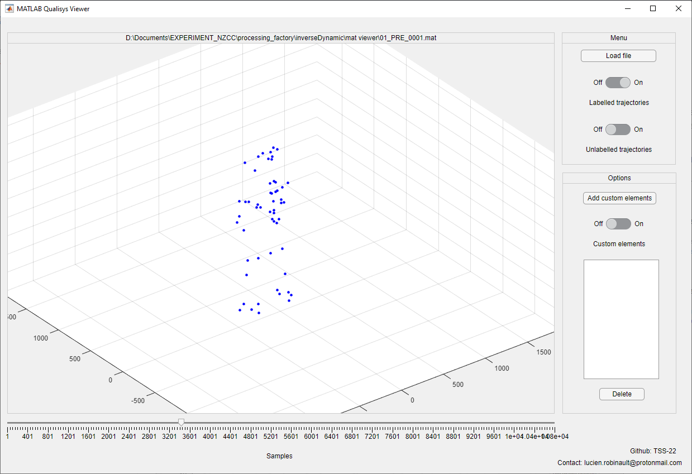

# Qualisys-.mat-files-viewer
A simple matlab app to view labelled and unabelled trajectory from a Qualisys .mat file

## Table of Contents
* [Inputs](#Inputs)
* [Setup](#Setup)
* [Technologies](#Technologies)
* [How to cite](#How-to-cite)
* [Disclaimer](#Disclaimer)
* [Contact](#Contact)

## Inputs
### Qualisys .mat files
Use .mat file of your acquisition converted to this format via Qualisys.

### Customs Elements files
The file needs to be of the following form:
Contains one structure, with field origin (3\*N vector). This is the coordinate X, Y, Z of your custom data point. N being the number of sample, it needs to match the number of samples of the Qualisys file you are using it with.
Alternatively, you can add vector to your custom data point, in order to visually analyze Local Coordinate Systems for example. 
To do so the file needs to be of the following form:
Containe one structure with fields:
  - origin (3\*N vector)
  - vectorX (3\*N vector)
  - vectorY (3\*N vector)
  - vectorZ (3\*N vector)
Respectively the coordinate of the origin of the LCS, the coordinate of the X vector, the Y vector and of the Z vector of the LCS.
You can add multiple custom elements, with or without vector (markers or LCS to put it simply).

## Setup
Download the .mlapp file then run it via matlab. Or install the standalone app from the standalone folder of the repository.

## Technologies
The project has been developped on MATLAB 2020b 9.9.0.1538559, on windows 10 64 bits.

## How to cite
If ever needed:

## Disclaimer
The information and tools contained in this repository are provided in good faith and no warranty, representation, statement or undertaking is given regarding any information or tool connected with this repository and any warranty, representation, statement or undertaking whatsoever that may be expressed or implied by statute, custom or otherwise is hereby expressly excluded.
The use of the tools in this repository and any information in this repository is entirely at the risk of the user.
Under no other circumstances the author should be liable for any costs, losses, expenses or damages (whether direct or indirect, consequential, special, economic or financial including any loss of profits) whatsoever that may be incurred through the use of any information or tools contained in this repository. This repository may contain inaccurate information. Which the author is under no responsibility to update or correct any such information or to even maintain this repository. Which the author reserves its right to change any information or any part of this repository without notice.

## Contact
lucien.robinault@protonmail.com
